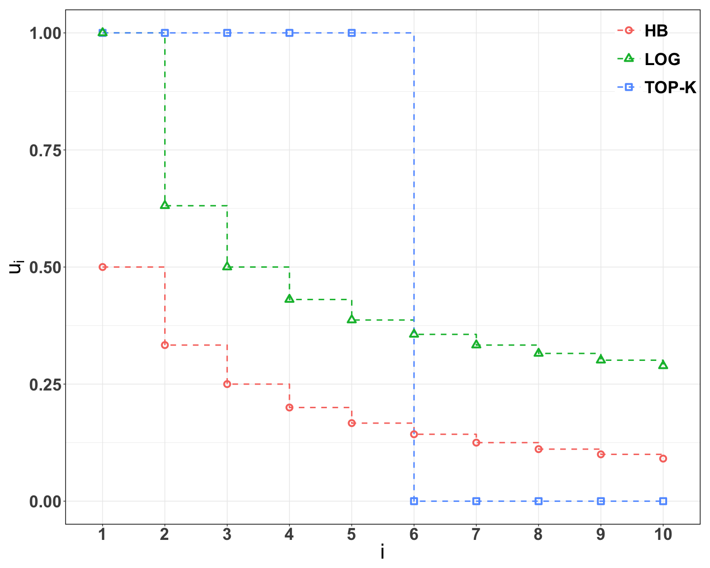
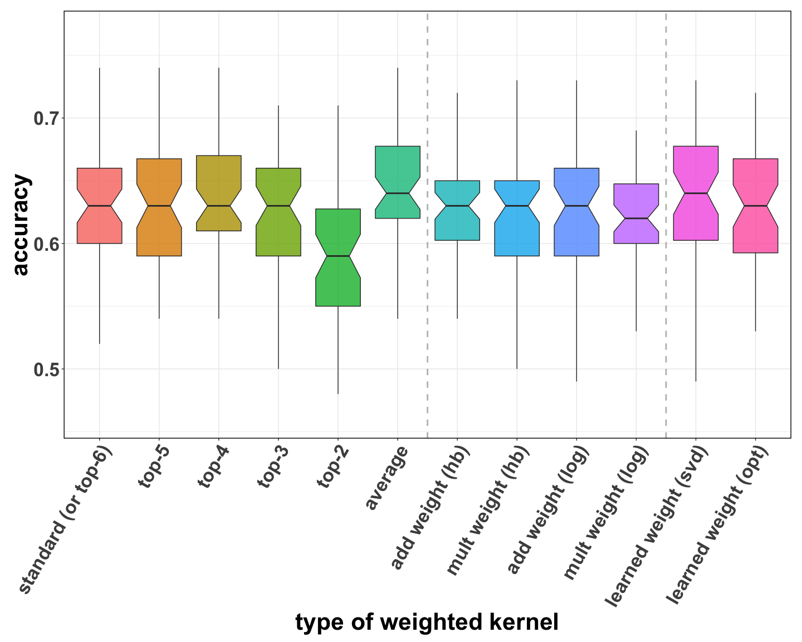
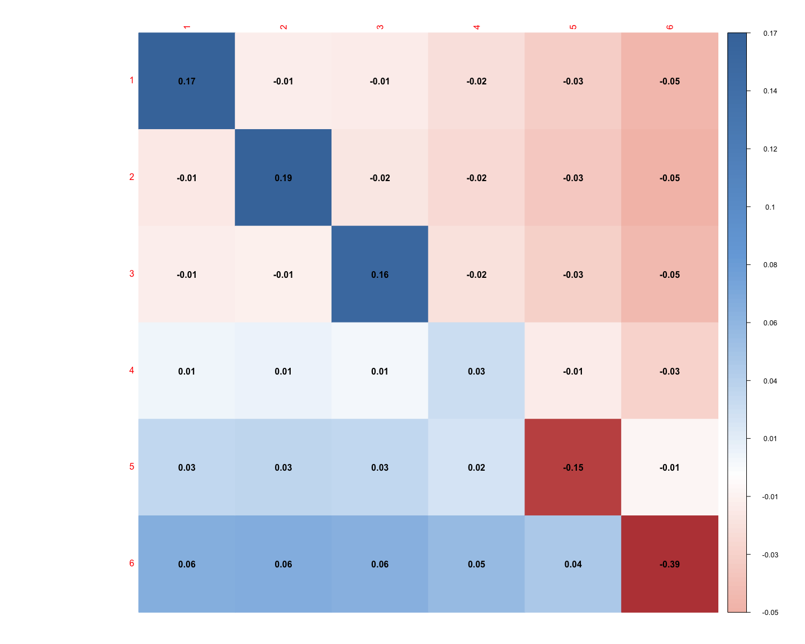

The Weighted Kendall Kernel for Permutations
================
Yunlong Jiao
June 12, 2018

-   [I. Eurobarometer (eubm) data and experimental setup](#i.-eurobarometer-eubm-data-and-experimental-setup)
-   [II. Classification of ranking data](#ii.-classification-of-ranking-data)
-   [III. Results](#iii.-results)
    -   [III.A. Weighted Kendall kernel](#iii.a.-weighted-kendall-kernel)
    -   [III.B. Classification accuracy](#iii.b.-classification-accuracy)
    -   [III.C. SUQUAN-SVD learned weights](#iii.c.-suquan-svd-learned-weights)
-   [IV. Session info](#iv.-session-info)

This notebook reproduces experiments of the paper:

> Yunlong Jiao, Jean-Philippe Vert. "The Weighted Kendall and High-order Kernels for Permutations." arXiv preprint arXiv:1802.08526, 2018. [arXiv:1802.08526](https://arxiv.org/abs/1802.08526)

``` r
knitr::opts_chunk$set(error = FALSE, warning = FALSE, message = FALSE, 
                      fig.width = 15, fig.height = 12)
options(stringsAsFactors = FALSE)
library(kernrank) # for fast kendall and weighted kendall
library(kernlab) # for svm and various kernels
library(caret) # for cv fold splits
library(ggplot2) # for general plots
library(corrplot) # for corr and heatmap plots
Rcpp::sourceCpp("../src/dots.cpp") # some dot functions
source("../R/func.R")
set.seed(70236562)
```

I. Eurobarometer (eubm) data and experimental setup
===================================================

Data are accessed, December 2017, online from the repository of the report:

> T. Christensen. "Eurobarometer 55.2: Science and tech- nology, agriculture, the euro, and internet access, may-june 2001." June, 2010. Cologne, Germany: GESIS/Ann Arbor, MI: Inter-university Consortium for Political and Social Research \[distributors\], 2010-06-30. [DOI:10.3886/ICPSR03341.v3](https://doi.org/10.3886/ICPSR03341.v3).

As part of the European Union survey Eurobarometer 55.2, participants were asked to rank, according to their opinion, the importance of six sources of information regarding scientific developments: TV, radio, newspapers and magazines, scientific magazines, the internet, school/university. The dataset also includes demographic information of the participants such as gender, nationality or age. The objective of this study is to predict the age group of participants from their ranking of 6 sources of news. Notably, this data was also studied in a similar supervised context in the following paper:

> H. Mania, et al. "On kernel methods for covariates that are rankings." arXiv preprint arXiv:1603.08035v2, 2017. [arXiv:1603.08035v2](https://arxiv.org/abs/1603.08035)

Raw data can be downloaded from the website [DOI:10.3886/ICPSR03341.v3](https://doi.org/10.3886/ICPSR03341.v3) where detailed description of the survey can also be found. Due to data protection policy, here we only provide the script below to process the raw data by anonymizing, randomizing, and subsampling the full dataset. Briefly, we removed all respondents who did not provide a complete ranking over all six sources, leaving a total of 12,216 participants. Then, we split the dataset across age groups, where 5,985 participants were 40 years old or younger, 6,231 were over 40. In order to perform classification, we chose to fit kernel SVMs with different kernels and compare.

``` r
# eubm data
dname <- "eubm"
datapath <- paste0("../data/dat_", dname, ".RData")
task <- "age"

# parameters to choose
nrep <- 50
ntr <- 400
ntst <- 100

# parameters specific to eubm data
p <- 6
ntot <- 12216

# process data
if (file.exists(datapath)) {
  dat <- get(load(datapath))
} else {
  # read full data
  d <- read.table("../data/ICPSR_03341/DS0001/03341-0001-Data.tsv", 
                  header = TRUE, sep = "\t")
  
  # get ranking data from survey no. Q5/V57-62 - x
  dx <- as.matrix(d[ , paste0("v", 57:62)])
  stopifnot(ncol(dx) == p)
  # keep full ranking only
  id.keep <- apply(dx, 1, function(u) all(sort(u) == seq(p)))
  stopifnot(sum(id.keep) == ntot)
  # further process such that larger values indicate higher preference
  dx <- t(apply(dx[id.keep, ], 1, function(u) return(p+1-u)))
  stopifnot(nrow(dx) == ntot)
  colnames(dx) <- c("TV", "RADIO", "NEWSP_MAGAZ", "SC_MAGAZINES", "INTERNET", "SCHOOL_UNIV")
  rownames(dx) <- paste0("ptcpt", 1:ntot)
  
  # get BINARY labels - y
  dy <- list(
    # age group from survey no. D11/V522
    "age" = factor(d[id.keep, "v522", drop=T] > 40, levels = c(TRUE,FALSE), labels = c("G40","LE40"))
  )
  stopifnot(all(sapply(dy, function(u) sum(table(u)) == ntot)))
  dy <- lapply(dy, function(u){ names(u) <- rownames(dx); return(u) })
  
  # save up full data just in case
  fulldat <- list(
    "x" = dx,
    "y" = dy
  )
  fulldatapath <- paste0("../data/fulldat_", dname, ".RData")
  save(fulldat, file = fulldatapath)
  rm(fulldat)
  
  # create data splits as a list structured as dat$`task`$`rep`$`xtrain, ytrain, xtest, ytest`
  dat <- lapply(seq(nrep), function(irep){
    lapply(dy, function(u){
      stopifnot(length(levels(u)) == 2)
      stopifnot(all(table(u) > (ntr+ntst)/2))
      stopifnot(length(u) == ntot)
      # evenly sample (ntr+ntst)/2 instances per group and get indices
      idx <- unlist(lapply(split(1:ntot, u), sample, 
                           size=(ntr+ntst)/2, replace=F))[sample(ntr+ntst, replace=F)]
      trainidx <- idx[1:ntr]
      testidx <- idx[(ntr+1):(ntr+ntst)]
      list(
        "trainidx" = trainidx,
        "testidx" = testidx,
        "xtrain" = dx[trainidx, , drop=F],
        "ytrain" = u[trainidx],
        "xtest" = dx[testidx, , drop=F],
        "ytest" = u[testidx]
      )
    })
  })
  names(dat) <- paste0("rep", seq_len(nrep))
  save(dat, file = datapath) # named just "dat"
}

# binary classification tasks
tasklist <- names(dat[[1]])
ntask <- length(tasklist)

# just to check
stopifnot(length(dat) == nrep)
stopifnot(length(dat[[1]][[1]]$ytrain) == ntr)
stopifnot(length(dat[[1]][[1]]$ytest) == ntst)
stopifnot(all(tasklist == task))
```

Subsampled datasets are provided in ../data/dat\_eubm.RData. To summarize the preprocessing above,

-   First, we extracted information from the eubm data, where a total of 1.221610^{4} participants gave full ranks in the order of preference 6 sources of news regarding scientific developments: TV, radio, newspapers and magazines, scientific magazines, the internet, school/university.
-   Then, we created 1 binary classification task(s) predicting participant's demographic information that is the age group (over or under 40 years old) of the participants.
-   Finally, we randomly generate 50 times train-test splits of data, where for each fold there are 400 training instances vs 100 test instances.

In order to perform classification, we chose to fit kernel SVMs with different kernels and compare. Further, the parameters set to run experiments in `parm` as follows:

``` r
# kernels defined in file R/func.R
# NOTE each kf has to START with ^dot_
kflist <- ls(pattern = "^dot_")
# add kendall at pos k ranging from 1 to (p-1)
key <- "dot_kenat"
if (key %in% kflist) {
  kflist <- c(setdiff(kflist, key), paste0(key, seq_len(p-1)))
}
# show kflist
kflist
```

    ##  [1] "dot_aken"          "dot_aosq2"         "dot_svdsq2"       
    ##  [4] "dot_wken_dcg_add"  "dot_wken_dcg_mult" "dot_wken_hb_add"  
    ##  [7] "dot_wken_hb_mult"  "dot_kenat1"        "dot_kenat2"       
    ## [10] "dot_kenat3"        "dot_kenat4"        "dot_kenat5"

``` r
# add label or alias for kfname
labellist <- c(
  "dot_kenat1" = "standard (or top-6)",
  "dot_kenat2" = "top-5",
  "dot_kenat3" = "top-4",
  "dot_kenat4" = "top-3",
  "dot_kenat5" = "top-2",
  "dot_aken" = "average",
  "dot_wken_hb_add" = "add weight (hb)",
  "dot_wken_hb_mult" = "mult weight (hb)",
  "dot_wken_dcg_add" = "add weight (log)",
  "dot_wken_dcg_mult" = "mult weight (log)",
  "dot_svdsq2" = "learned weight (svd)",
  "dot_aosq2" = "learned weight (opt)"
)
label.sep <- c(6.5, 10.5) # to separate label in boxplot
stopifnot(all(kflist %in% names(labellist)))

# parameters set to run experiments
dlist <- dname
parm <- expand.grid(
  "dname" = as.character(dlist), # data
  "task" = as.character(tasklist), # binary classification tasks
  "irep" = as.integer(seq_len(nrep)), # rep idx
  "kfname" = as.character(kflist), # kernel
  KEEP.OUT.ATTRS = FALSE, stringsAsFactors = FALSE
)
head(parm)
```

    ##   dname task irep   kfname
    ## 1  eubm  age    1 dot_aken
    ## 2  eubm  age    2 dot_aken
    ## 3  eubm  age    3 dot_aken
    ## 4  eubm  age    4 dot_aken
    ## 5  eubm  age    5 dot_aken
    ## 6  eubm  age    6 dot_aken

``` r
dim(parm)
```

    ## [1] 600   4

II. Classification of ranking data
==================================

As described in the last section, we perform classification by fitting SVMs with different kernels and compare the classification accuracy on the random train-test splits of the eubm data. As the experiment might take long to finish, for ease of rewriting the script to run the experiments on the server in case, code will organized to be easily parallelizable with results being saved locally and later loaded back in.

``` r
# set path to save Robj
savepath <- "Robj/"
if (!dir.exists(savepath))
  dir.create(savepath)

# run classification and evaluate performance
scores <- list()
for (i in seq(nrow(parm))) {
  message("i = ", i, " out of ", nrow(parm))
  ags <- as.vector(as.matrix(parm[i, ]))
  # dname <- as.character(ags[1])
  # task <- as.character(ags[2])
  irep <- as.integer(ags[3])
  kfname <- as.character(ags[4])
  
  objname <- paste(c("res", ags), collapse = "_")
  objpath <- paste0(savepath, objname, ".RData")
  
  # classification
  if (file.exists(objpath)) {
    res <- get(load(objpath))
    message(i, '-th job already done !!')
  } else {
    # datapath <- paste0("../data/dat_", dname, ".RData")
    # dat <- get(load(datapath))
    res <- perfSVM(kfname = kfname, 
                   xtrain = dat[[irep]][[task]]$xtrain, 
                   ytrain = dat[[irep]][[task]]$ytrain, 
                   xtest = dat[[irep]][[task]]$xtest, 
                   ytest = dat[[irep]][[task]]$ytest)
    save(res, file = objpath) # named just "res"
    message(i, '-th job saved up !!')
  }
  
  # evaluation
  scores[[i]] <- data.frame(
    ags,
    "acc" = res$acc,
    row.names = NULL
  )
  rm(res)
}
scores <- do.call('rbind', scores)
rownames(scores) <- seq(nrow(scores))
scores$label <- labellist[scores$kfname]
# save up
write.table(scores, file = "scores.txt", 
            row.names = TRUE, col.names = TRUE, sep = '\t', quote = TRUE)
```

III. Results
============

``` r
# read back in scores table
scores <- read.table("scores.txt")
scores$label <- ordered(labellist[scores$kfname], levels = labellist)
head(scores)
```

    ##   dname task irep   kfname  acc   label
    ## 1  eubm  age    1 dot_aken 0.66 average
    ## 2  eubm  age    2 dot_aken 0.51 average
    ## 3  eubm  age    3 dot_aken 0.59 average
    ## 4  eubm  age    4 dot_aken 0.64 average
    ## 5  eubm  age    5 dot_aken 0.67 average
    ## 6  eubm  age    6 dot_aken 0.64 average

``` r
# theme for plots
p.theme <- theme_bw() + 
  theme(legend.justification = c(1,1), legend.position = c(1,1), 
        legend.title = element_blank(), 
        legend.key.size = unit(0.6, "in"), 
        legend.background = element_rect(alpha("white", 0)), 
        panel.border = element_rect(colour = "black", size = 1), 
        text = element_text(size = 32, colour = "black", face = "bold"), 
        title = element_text(size = 32, colour = "black", face = "bold"), 
        plot.margin = unit(c(1, 1, 1, 1), "lines"))

# color palette for visualizing learned weights
cols.weights <- colorRampPalette(c("#BB4444","#EE9988","#FFFFFF","#77AADD","#4477AA"))(200)

# color palette for visualizing p matrix
cols.pmat <- colorRampPalette(c("#011f4b","#03396c","#005b96","#6497b1","#b3cde0"))(200)
```

III.A. Weighted Kendall kernel
------------------------------

Plot of reduction factor in weighted Kendall kernel:

``` r
N <- 10
d <- data.frame(
  "x" = factor(c(1:N, 1:N, 1:N)),
  "y" = c(rep(1,ceiling(N/2)),rep(0,N-ceiling(N/2)), 1/(1+1:N), 1/log2(1+1:N)),
  "grp" = c(rep("TOP-K",N), rep("HB",N), rep("LOG",N))
)
ggplot(d, aes(x = x, y = y)) + 
  geom_step(aes(color = grp, group = grp), linetype = 2, size = 1) + 
  geom_point(aes(color = grp, shape = grp), size = 3, stroke = 2) + 
  scale_shape(solid = FALSE) + 
  ylim(0,1) + xlab(expression(i)) + ylab(expression('u'[i])) + 
  p.theme
```



III.B. Classification accuracy
------------------------------

Comparison of classication accuracy of different kernels:

``` r
# calculate mean and sd of acc per kernel
ms <- tapply(scores$acc, scores$label[ , drop=T], mean)
sds <- tapply(scores$acc, scores$label[ , drop=T], sd)
o <- order(ms, decreasing = TRUE)
tab <- data.frame("Mean"=ms, "SD"=sds, "p.value"=NA)[o, ]
# signif test of better-perf kernels
scores.sp <- split(scores, scores$label, drop = TRUE)
stopifnot(length(o) == length(scores.sp))
key <- labellist["dot_kenat1"]
keyid <- which(rownames(tab) == key)
pmatrix <- matrix(NA, nrow = length(scores.sp), ncol = length(scores.sp), 
                  dimnames = list(names(scores.sp),names(scores.sp)))
pmatrix <- pmatrix[o,o] # reorder by decreasing mean perf
for (i in 1:(keyid-1)) {
  si <- scores.sp[[rownames(tab)[i]]]$acc
  sj <- scores.sp[[rownames(tab)[keyid]]]$acc
  stopifnot(length(si) == length(sj))
  tab[i,"p.value"] <- wilcox.test(x = si, y = sj, alternative = "greater", 
                                  exact = F, mu = 0, paired = T)$p.value
}

# table
knitr::kable(round(tab, 4))
```

|                      |    Mean|      SD|  p.value|
|----------------------|-------:|-------:|--------:|
| average              |  0.6406|  0.0579|   0.0052|
| learned weight (svd) |  0.6352|  0.0512|   0.0724|
| top-4                |  0.6318|  0.0534|   0.3134|
| top-5                |  0.6312|  0.0491|   0.2009|
| add weight (hb)      |  0.6276|  0.0480|   0.5908|
| standard (or top-6)  |  0.6274|  0.0504|       NA|
| add weight (log)     |  0.6272|  0.0500|       NA|
| learned weight (opt) |  0.6256|  0.0514|       NA|
| top-3                |  0.6242|  0.0442|       NA|
| mult weight (hb)     |  0.6230|  0.0478|       NA|
| mult weight (log)    |  0.6180|  0.0483|       NA|
| top-2                |  0.5898|  0.0506|       NA|

``` r
# boxplot
ggplot(scores, aes(x = label, y = acc)) + 
  geom_boxplot(aes(fill = label), alpha = 0.8, outlier.shape = NA, notch = TRUE) + 
  geom_vline(xintercept = label.sep, color = "grey", size = 1, linetype = 2) + 
  labs(x = "type of weighted kernel", y = "accuracy") + 
  p.theme + 
  guides(fill = FALSE) + 
  theme(axis.text.x = element_text(angle = 60, hjust = 1))
```



III.C. SUQUAN-SVD learned weights
---------------------------------

Plot of weights in a weighted kernel learned via SUQUAN-SVD (Algorithm 1, Le Morvan and Vert, 2017):

``` r
weightspath <- "weights.txt"
if (file.exists(weightspath)) {
  f <- as.matrix(read.table(weightspath))
  dimnames(f) <- list(1:p,1:p)
} else {
  # Randomly split full data and get SUQUAN-SVD weights
  fulldatapath <- paste0("../data/fulldat_", dname, ".RData")
  load(fulldatapath)
  n <- nrow(fulldat$x)
  p <- ncol(fulldat$x)
  
  set.seed(26121989)
  foldIndices <- caret::createMultiFolds(1:n, 10, 50)
  flist <- lapply(foldIndices, function(fold){
    x <- fulldat$x[fold, , drop=F]
    y <- fulldat$y[[task]][fold]
    classes <- levels(factor(y))
    stopifnot(length(classes) == 2)
    
    # c.f. Algorithm 1 of (Le Morvan and Vert, 2017)
    idx1 <- which(y == classes[1])
    idx2 <- which(y == classes[2])
    ybin.lda <- numeric(length(y))
    ybin.lda[idx1] <- -1/length(idx1)
    ybin.lda[idx2] <- 1/length(idx2)
    M <- mlda2(x, ybin.lda)
    f <- svd(M, nu = 1, nv = 0)$u
    dim(f) <- c(p, p)
    f
  })
  f <- Reduce('+', flist)/length(flist)
  
  # reverse order so that larger values imply smaller rank
  f <- f[p:1,p:1]
  dimnames(f) <- list(1:p,1:p)
  write.table(f, file = weightspath, 
              row.names = TRUE, col.names = TRUE, sep = '\t', quote = TRUE)
}

# plot
corrplot(f, method = "color", col = cols.weights, is.corr = FALSE, cl.pos = "r",
         addCoef.col = "black", mar = c(0,0,1,0))
```



IV. Session info
================

``` r
devtools::session_info()
```

    ##  setting  value                       
    ##  version  R version 3.4.3 (2017-11-30)
    ##  system   x86_64, darwin15.6.0        
    ##  ui       X11                         
    ##  language (EN)                        
    ##  collate  en_US.UTF-8                 
    ##  tz       Europe/London               
    ##  date     2018-06-28                  
    ## 
    ##  package      * version   date       source         
    ##  assertthat     0.2.0     2017-04-11 CRAN (R 3.4.0) 
    ##  backports      1.1.2     2017-12-13 CRAN (R 3.4.3) 
    ##  base         * 3.4.3     2017-12-07 local          
    ##  bindr          0.1.1     2018-03-13 CRAN (R 3.4.4) 
    ##  bindrcpp       0.2       2017-06-17 CRAN (R 3.4.0) 
    ##  broom          0.4.3     2017-11-20 CRAN (R 3.4.3) 
    ##  caret        * 6.0-78    2017-12-10 CRAN (R 3.4.3) 
    ##  class          7.3-14    2015-08-30 CRAN (R 3.4.3) 
    ##  codetools      0.2-15    2016-10-05 CRAN (R 3.4.3) 
    ##  colorspace     1.3-2     2016-12-14 CRAN (R 3.4.0) 
    ##  combinat       0.0-8     2012-10-29 CRAN (R 3.4.0) 
    ##  compiler       3.4.3     2017-12-07 local          
    ##  corrplot     * 0.84      2017-10-16 CRAN (R 3.4.2) 
    ##  CVST           0.2-1     2013-12-10 CRAN (R 3.4.0) 
    ##  datasets     * 3.4.3     2017-12-07 local          
    ##  ddalpha        1.3.1.1   2018-02-02 CRAN (R 3.4.3) 
    ##  DEoptimR       1.0-8     2016-11-19 CRAN (R 3.4.0) 
    ##  devtools       1.13.5    2018-02-18 CRAN (R 3.4.3) 
    ##  digest         0.6.15    2018-01-28 CRAN (R 3.4.3) 
    ##  dimRed         0.1.0     2017-05-04 CRAN (R 3.4.0) 
    ##  dplyr          0.7.4     2017-09-28 CRAN (R 3.4.2) 
    ##  DRR            0.0.3     2018-01-06 CRAN (R 3.4.3) 
    ##  evaluate       0.10.1    2017-06-24 CRAN (R 3.4.1) 
    ##  foreach        1.4.4     2017-12-12 CRAN (R 3.4.3) 
    ##  foreign        0.8-69    2017-06-22 CRAN (R 3.4.3) 
    ##  ggplot2      * 2.2.1     2016-12-30 CRAN (R 3.4.0) 
    ##  glue           1.2.0     2017-10-29 CRAN (R 3.4.2) 
    ##  gower          0.1.2     2017-02-23 CRAN (R 3.4.0) 
    ##  graphics     * 3.4.3     2017-12-07 local          
    ##  grDevices    * 3.4.3     2017-12-07 local          
    ##  grid           3.4.3     2017-12-07 local          
    ##  gtable         0.2.0     2016-02-26 CRAN (R 3.4.0) 
    ##  highr          0.6       2016-05-09 CRAN (R 3.4.0) 
    ##  htmltools      0.3.6     2017-04-28 CRAN (R 3.4.0) 
    ##  ipred          0.9-6     2017-03-01 CRAN (R 3.4.0) 
    ##  iterators      1.0.9     2017-12-12 CRAN (R 3.4.3) 
    ##  kernlab      * 0.9-26    2018-04-30 cran (@0.9-26) 
    ##  kernrank     * 1.1.0     2018-06-26 local          
    ##  knitr          1.20      2018-02-20 CRAN (R 3.4.3) 
    ##  labeling       0.3       2014-08-23 CRAN (R 3.4.0) 
    ##  lattice      * 0.20-35   2017-03-25 CRAN (R 3.4.3) 
    ##  lava           1.6       2018-01-13 CRAN (R 3.4.3) 
    ##  lazyeval       0.2.1     2017-10-29 CRAN (R 3.4.2) 
    ##  lubridate      1.7.3     2018-02-27 CRAN (R 3.4.3) 
    ##  magrittr       1.5       2014-11-22 CRAN (R 3.4.0) 
    ##  MASS           7.3-49    2018-02-23 CRAN (R 3.4.3) 
    ##  Matrix         1.2-12    2017-11-20 CRAN (R 3.4.3) 
    ##  memoise        1.1.0     2017-04-21 CRAN (R 3.4.0) 
    ##  methods        3.4.3     2017-12-07 local          
    ##  mnormt         1.5-5     2016-10-15 CRAN (R 3.4.0) 
    ##  ModelMetrics   1.1.0     2016-08-26 CRAN (R 3.4.0) 
    ##  munsell        0.4.3     2016-02-13 CRAN (R 3.4.0) 
    ##  nlme           3.1-131.1 2018-02-16 CRAN (R 3.4.3) 
    ##  nnet           7.3-12    2016-02-02 CRAN (R 3.4.3) 
    ##  parallel       3.4.3     2017-12-07 local          
    ##  pillar         1.2.1     2018-02-27 CRAN (R 3.4.3) 
    ##  pkgconfig      2.0.1     2017-03-21 CRAN (R 3.4.0) 
    ##  plyr           1.8.4     2016-06-08 CRAN (R 3.4.0) 
    ##  prodlim        1.6.1     2017-03-06 CRAN (R 3.4.0) 
    ##  psych          1.7.8     2017-09-09 CRAN (R 3.4.3) 
    ##  purrr          0.2.4     2017-10-18 CRAN (R 3.4.2) 
    ##  R6             2.2.2     2017-06-17 CRAN (R 3.4.0) 
    ##  Rcpp           0.12.17   2018-05-18 cran (@0.12.17)
    ##  RcppRoll       0.2.2     2015-04-05 CRAN (R 3.4.0) 
    ##  recipes        0.1.2     2018-01-11 CRAN (R 3.4.3) 
    ##  reshape2       1.4.3     2017-12-11 CRAN (R 3.4.3) 
    ##  rlang          0.2.0     2018-02-20 CRAN (R 3.4.3) 
    ##  rmarkdown      1.9       2018-03-01 CRAN (R 3.4.3) 
    ##  robustbase     0.92-8    2017-11-01 CRAN (R 3.4.2) 
    ##  rpart          4.1-13    2018-02-23 CRAN (R 3.4.3) 
    ##  rprojroot      1.3-2     2018-01-03 CRAN (R 3.4.3) 
    ##  rstudioapi     0.7       2017-09-07 CRAN (R 3.4.1) 
    ##  scales         0.5.0     2017-08-24 CRAN (R 3.4.1) 
    ##  sfsmisc        1.1-2     2018-03-05 CRAN (R 3.4.4) 
    ##  splines        3.4.3     2017-12-07 local          
    ##  stats        * 3.4.3     2017-12-07 local          
    ##  stats4         3.4.3     2017-12-07 local          
    ##  stringi        1.1.7     2018-03-12 CRAN (R 3.4.4) 
    ##  stringr        1.3.0     2018-02-19 CRAN (R 3.4.3) 
    ##  survival       2.41-3    2017-04-04 CRAN (R 3.4.3) 
    ##  tibble         1.4.2     2018-01-22 CRAN (R 3.4.3) 
    ##  tidyr          0.8.0     2018-01-29 CRAN (R 3.4.3) 
    ##  tidyselect     0.2.4     2018-02-26 CRAN (R 3.4.3) 
    ##  timeDate       3043.102  2018-02-21 CRAN (R 3.4.3) 
    ##  tools          3.4.3     2017-12-07 local          
    ##  utils        * 3.4.3     2017-12-07 local          
    ##  withr          2.1.1     2017-12-19 CRAN (R 3.4.3) 
    ##  yaml           2.1.18    2018-03-08 CRAN (R 3.4.4)
